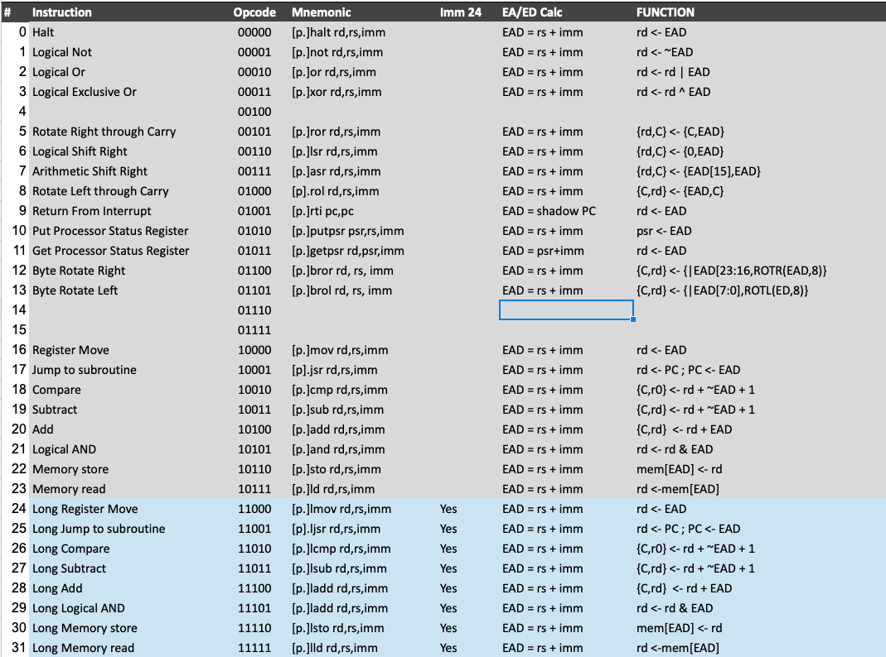

OPC-8 Definition
-----------------

OPC-8 is a pure 24 bit [One Page Computer](.) with a 16 entry register file based very largely on the earlier
OPC-7 and OPC-6 machines.

All memory accesses are 24 bits wide and instructions are encoded in either one or two words

    ppp ooooo dddd ssss iiiiiiii    nnnnnnnnnnnnnnnn
     \    \     \    \       \           \____________ 24b optional long immediate
      \    \     \    \       \_______________________  8b short immediate
       \    \     \    \______________________________  4b source register address
        \    \     \__________________________________  4b destination register address
         \    \_______________________________________  5b opcode
          \___________________________________________  3b predicate bits                         

On reset the processor will start executing instructions from location 0.

OPC-8 has a 16 entry register file. Each instruction can specify one register as a source and another as both source
and destination using the two 4 bit fields in the encoding. Two of the registers have special purposes:

  * R0 holds 'all-zeros'. It is legal to write R0 but this has no effect on the register contents.
  * R15 is the program counter. This can be written or read like any other register.
  
The address bus and program counter are both 24 bits wide.

All intructions can use an 8 bit short immediate value.

When the source register is not R0, the value will be sign extended to 24 bits. In this case the valid range of a 8b immediate is 0x000000->0x00007F and 0xFFFF80->0xFFFFFF.

When the source register is R0, the value will be left unsigned and the upper bytes of the immediate will be filled with zeros. In this case the valid range of an 8b immediate is -1 < immediate < 256

Only a sub-set of instructions allow a full 24b immediate value to be used  - see the Instruction Set table for details.

Addressing Modes and Effective Address/Data Computation
-------------------------------------------------------

The 24b effective address or data (EAD) for all instructions is created by adding the 8b or 24b operand to the source register.
By using combinations of the zero register and zero operands with the LD and STO instructions the following addressing modes are supported:

  |  Mode          | Source Reg | Operand   |  Effective address/Data  | 
  |--------------- |------------|-----------|--------------------------|
  | Direct         | R0         | \<addr\>  | mem[\<addr\>]            |
  | Indirect       | \<reg\>    | 0         | mem[\<reg\>]             | 
  | Indexed        | \<reg\>    | \<index\> | mem[\<reg\> + \<index\>] | 
  | Immediate      | R0         | \<immed\> | \<immed\>                | 

Processor Status Register
-------------------------

The processor has an 8 bit processor status register. Included in this are three processor status flags which 
are set by ALU operations - calculation of the EA/ED values has no effect on these - and 5 bits related to interrupt
handling. 

  * SWI   - 4 bits used to identify a software interrupt. Writing a non-zero value here triggers a SWI.
  * EI    - used to enable or disable hardware interrupts
  * Carry - set or cleared only on arithmetic operations
  * Zero  - set on every instruction based on the state of the destination register
  * Sign  - set when the MSB of the result is a '1'

Instruction Set
---------------

Notes:

  * Where a [p.] is shown in the table, the instruction can be prefixed with a predicate (see table below) for conditional execution dependent on the state of the chosen flags
  * All effective data/address calculations are truncated to 24 bits and do not affect any of the processor flags
  * add rd,rd can be used to synthesize an arithmetic shift left (asl) instruction

Predication
-----------

All instructions can have predicated execution and this is determined by the three instruction MSBs and indicated by
a prefix on the instruction mnemonic in the assembler.

  | P0 | P1 | P2 | Asm Prefix | Function                                           |
  |----|----|----|------------|----------------------------------------------------|
  |  0 |  0 |  0 | 1. or none | Always execute                                     |
  |  0 |  0 |  1 | 0.         | Never execute (nop)                                |
  |  0 |  1 |  0 | z.         | Execute if Zero flag is set                        |
  |  0 |  1 |  1 | nz.        | Execute if Zero flag is clear                      |
  |  1 |  0 |  0 | c.         | Execute if Carry flag is set                       |
  |  1 |  0 |  1 | nc.        | Execute if Carry flag is clear                     |
  |  1 |  1 |  0 | mi.        | Execute if Sign flag is set                        |
  |  1 |  1 |  1 | pl.        | Execute if Sign flag is clear                      |
  
Byte Rotate Instructions
------------------------

OPC-8 has two byte rotate instructions. Unlike the bit rotates these don't rotate through the carry flag. For byte rotate left the carry flag is set if any of the bits in the topmost byte of the source are non-zero. For byte rotate right the carry is set if any of the bits in the lowest byte of the source are non-zero.

Interrupts
----------
  
OPC-8 has two interrupt inputs for hardware interrupts: int\_b[1:0].
  
If either of these inputs is taken low, then the processor with finish executing the current instruction and jump to a restart vector at either 0x000002 (for int\_b[0]) or 0x000004 (for int\_b[1]). If both interrupt pins are low at the same time then the processor will jump to 0x000004 to service int\_b[1] first.
  
Additionally there is an ability to cause software interrupts by writing a non-zero value to the SWI bits (see above) using the PUTPSR instruction. Software interrupts are also vectored to address 0x0002 in common with the hardware interrupt for int\_b[0]. The interrupt service routine is responsible for reading the processor status register to determine the interrupt source.
